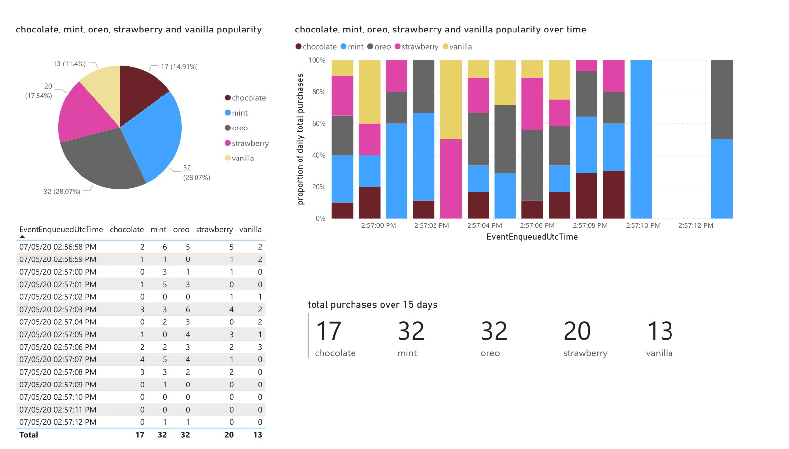
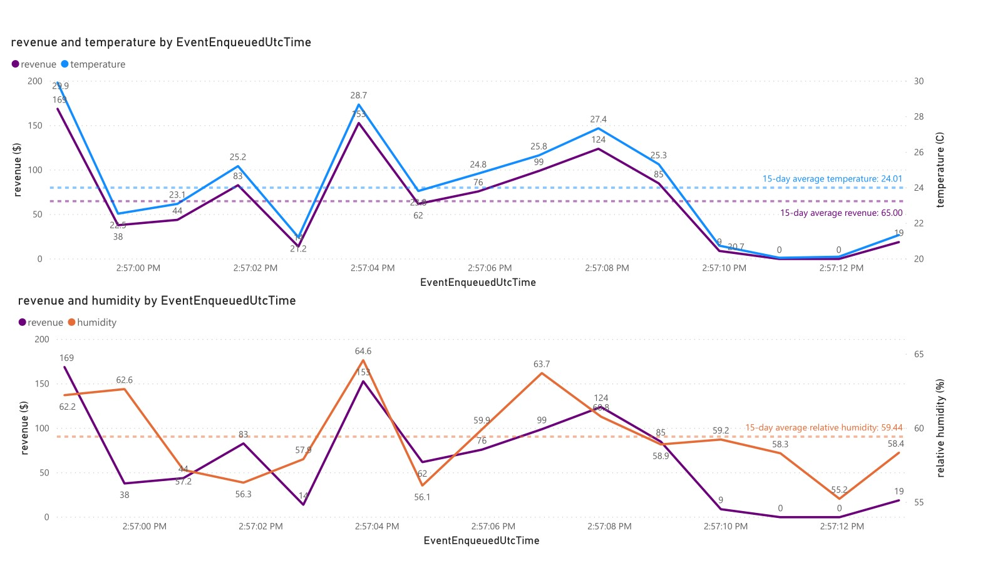

# Telemetry simulation using Azure IoT Hub and Power BI

**This project is a submission for the 2020**
**Microsoft Student Accelerator Program, Azure Cloud Fundamentals bootcamp**
**(technical stream).**

## Table of contents

- [Telemetry simulation using Azure IoT Hub and Power BI](#telemetry-simulation-using-azure-iot-hub-and-power-bi)
  - [Table of contents](#table-of-contents)
  - [Description](#description)
  - [Setup](#setup)
  - [Running the simulation](#running-the-simulation)
  - [Visualisations](#visualisations)

## Description

The client script [`simulated_device.py`](simulated_device.py) simulates a
point-of-sale machine in a small ice cream shop. It generates data
continuously every second, and each message sent is to represent data from a
single trading period (day).

The data sent contains daily revenue, temperature and humidity information,
as well as the number of purchases for each ice cream flavour on that day.

Simulation details:

- Higher temperature increases the number of customers (purchases).
- Higher humidity increases the number of customers (purchases).
- There are 5 flavours, each priced differently, and customers are more likely
  to choose more expensive flavours.

The details above are reflected in the visualisation done in Power BI.

## Setup

IoT Hub:

1. Create a new resource in Azure: IoT Hub (F1: Free Tier).
2. Create a new device in the IoT Hub.
3. Use that device's primary connection string to send messages in the
   client script with IoTHubDeviceClient.
4. Under 'built-in endpoints', create a new consumer group.

Stream Analytics:

1. Create a new resource in Azure: Stream Analytics job
   (in the same resource group as the IoTHub)
2. Add the IoTHub as a stream input (with the 'service' shared access policy,
   and the newly created consumer group)
3. Add Power BI as an output (needs authorisation)
4. Create a query: `SELECT * INTO yourOutputName FROM yourInputName`

The python script requires `azure.iot.device`. Install it with:

```bash
pip install azure-iot-device
```

in a Conda/venv environment or otherwise.

## Running the simulation

1. Start the Stream Analytics job.
2. Run the client script locally.

To verify the connection to the IoT Hub, run the following in the Azure CLI:

```bash
az iot hub monitor-events --hub-name yourHubName --device-id yourDeviceId
```

Messages sent from the client script should appear.

Then, there should be a new dataset in your Power BI workspace. This dataset
is live data and continually grows as the client sends more messages. The
data persists even after the Stream Analytics job or client script is stopped
(to reset the data, simply delete the dataset). Reports can be made from the
dataset, to visualise and summarise the telemetry data.

## Visualisations

Below are two key visualisations from a simulation that was run for 15 seconds
(corresponding to 15 trading days):





The complete Power BI report from this sample run was exported as
[IceCreamReport.pdf](./results/IceCreamReport.pdf) and
[IceCreamReport.pptx](./results/IceCreamReport.pptx).
